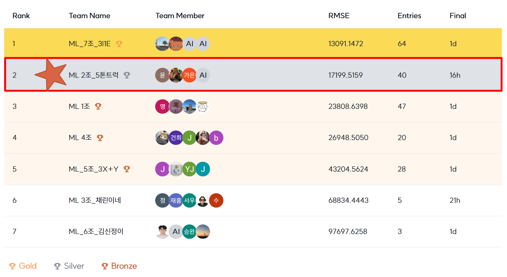

# 🏠 Seoul House Price Prediction Competition

## Team

|  |  |  |  |
| :--------------------------------------------------------------: | :--------------------------------------------------------------: | :--------------------------------------------------------------: | :--------------------------------------------------------------: |
|                            김수환(팀장)                             |                            김병현                           |                            이가은                             |                            이윤서                         |


## 1. Competiton Info

### Overview
이번 대회는 서울시 아파트의 실거래 가격을 예측하는 머신러닝 모델을 만드는 대회입니다.  <br>
아파트 가격은 단순히 면적이나 연식뿐만 아니라, 주변 환경과 교통, 입지 조건 등에 따라 크게 달라집니다.  <br> 또한 정확한 예측 모델은 매수·매도자 모두에게 도움이 되고, 정부 입장에서도 이상 거래나 투기 정황을 파악하는 데 활용될 수 있다고 생각합니다.

저희 팀은 다양한 데이터를 분석하고, 전처리와 피처 엔지니어링, 모델 학습 과정을 거쳐 서울 아파트 실거래가를 최대한 정확하게 예측하는 데 도전하였습니다.


<br>

### 개발환경
* Python 3.10
* Git
* VS Code (원격 서버 연결)
* 모든 matplotlib에서 기본 한글 폰트(나눔바름고딕) 사용

<br>

### Timeline

- 25년 7월 7일 (월) 10:00 - Housing Price Prediction 시작
- 25년 7월 7일 첫미팅
- 25년 7월 9일 경진대회를 위한 환경구성 논의, 방향성을 위한 미팅
- 25년 7월 10일 베이스라인 코드리뷰 미팅
- 25년 7월 14일 파생변수, 전처리 방식, 모델 리뷰 및 피드백
- 25년 7월 15일 Git repo. directory 구성 논의
- 25년 7월 16일 멘토링 및 좌표를 통한 파생변수 생성 가능성 논의
- 25년 7월 17일 (목) 19:00 - 최종 제출 마감

### Evaluation
- 평가 지표 : RMSE
- 모델 성능평가 방법 : 5fold - Cross Validation RMSE, Test Set RMSE(리더보드)

## 2. Components
============================================

### Directory
```
├──  1.Data                     # 데이터 저장소
├──  2.Notebook                 # EDA, 전처리, Modeling 작업 jupyter notebook 저장소
│    ├──  1.EDA                 # EDA jupyter notebook 저장소
│    ├──  2.Pre_processing      # 전처리 jupyter notebook 저장소
│    └──  3.Model               # Modeling jupyter notebook 저장소
├──  3.src                      # 전처리, 시각화 관련 모듈 저장소
├──  4.Submission               # 리더보드 제출파일 저장소
├──  5.Reports                  # 결과 보고서 및 시각화 자료
└──  docs                       # .gitignore & README.md
```

## 3. Data descrption
========================

### Dataset overview

### Dataset overview

- **데이터 출처**: 서울시 아파트 실거래가 (2007년 ~ 2023년 6월)
- **문제 유형**: 회귀(Regression)
- **예측 목표**: 아파트 실거래 가격(`target`) 예측
- **데이터 구성**:
  - `train.csv`: 학습용 데이터
  - `test.csv`: 테스트 데이터
  - `submission.csv`: 예측 결과 제출용
- **주요 변수 예시**: `계약년월`, `시군구`, `아파트명`, `전용면적`, `층`, `건축년도`, `거래금액`

### EDA

1. **결측치 분석**
   - 결측 비율 > 30% 컬럼은 제거
   - 범주형은 `'NULL'` 대체, 수치형은 선형 보간 사용

2. **이상치 탐지 & 처리**
   - `전용면적`, `세대당 면적`, `주차대수` 등의 변수는 **상하위 0.5% 클리핑**
   - 일부 변수는 `log1p()` 변환 적용하여 분포 왜곡 완화

3. **변수 간 상관관계 분석**
   - 다중공선성 또는 redundancy 있는 변수 제거

4. **시각화**
   - 히스토그램, boxplot, 히트맵 등을 활용해 변수 분포 및 이상치 확인  
   - 계약일 시계열 흐름 분석 → **최근일수록 가격 상승 추세** 포착

> 결론: 전처리를 통해 **모델이 학습에 집중할 수 있도록 노이즈 제거 & 유효 변수 구성** 완료

### Feature engineering

| 유형         | 최종 사용 Feature 목록 |
|--------------|--------------------------|
| 범주형 변수   | `'season'`, `'new_old'`, `'구'`, `'동'` |
| 수치형 변수   | `'전용면적'`, `'층'`, `'contract_date'`, `'covid'`, `'contract_month_sin'`, `'contract_month_cos'`, `'apt_age'` |
| 생성 파생변수 | `contract_date` (날짜 → 숫자), `contract_month_sin`, `contract_month_cos` (계절성 인코딩), `apt_age` (건축연도 기반 나이), `covid` (2020년 이상 마스킹), `season` (월 → 계절) |
| 최종 변수 수 | 총 12개 컬럼 (타깃 포함) |

> 💡 도메인 해석을 통해 계약월을 사인/코사인으로 분해하고, 건축연도 → `apt_age`로 전환하는 등 시계열적 흐름을 보존하는 feature engineering 전략을 사용하였습니다.

## 4. Modeling

### Model descrition

- **사용한 모델**
  - `RandomForestRegressor`
  - `LightGBMRegressor`

- **선택 이유**
  - **RandomForest**: 구조적 결측치에 강하며, baseline 모델로 적합
  - **LGBM**: 빠른 학습 속도, 낮은 메모리 사용, 범주형 자동 처리 등 고성능 모델로 사용

- **기타 특징**
  - 두 모델 모두 회귀 문제에 적합
  - feature importance 시각화 및 변수 제거 기준 참고 지표로 활용

### Modeling Process

1. **데이터 분리**:
   - 학습/검증: `train_test_split` 또는 `StratifiedKFold(5)` 기반 분할
   - 테스트 데이터는 리더보드 제출용으로 별도 분리

2. **타깃 변환**:
   - `np.log1p(target)` 형태로 로그 변환 후 학습
   - 예측 결과는 `np.expm1()`로 다시 복원

3. **RandomForest 모델**
   - 기본 파라미터로 baseline 점수 확보
   - 피처 수 증가 시 과적합 발생 경향 → 성능 한계

4. **LGBM 모델**
   - 주요 파라미터 튜닝: `num_leaves`, `learning_rate`, `max_depth`, `n_estimators`
   - GPU 학습으로 빠른 실험 가능

## 5. Result

### Leader Board

- 

<br>

### Presentation

- [구글 공유 PPT](https://docs.google.com/presentation/d/16LZyUOZ967hDMhL7_TC0HLsDK_VGk_VG/edit?slide=id.p11#slide=id.p11)


<br>
<br>

## etc

### Meeting Log

- https://www.notion.so/20240707_-22940cb3731d808c9b0dc3648029c2a6?source=copy_link
- https://www.notion.so/20250708_-22c40cb3731d80e0b58ecd2d41a643b6?source=copy_link
- https://www.notion.so/20250710_-23040cb3731d802b9e9eeda7e60a74a8?source=copy_link
- https://www.notion.so/20250714_-23140cb3731d801e9386dd2f5916e27e?source=copy_link
- https://www.notion.so/20250715_-23240cb3731d80d8a92ec42b7fba88f6?source=copy_link
- https://www.notion.so/20250716_-23340cb3731d8059847ff7f3d91d8081?source=copy_link
- https://www.notion.so/20250717_-23340cb3731d80f89a46dd4b49e2debb?source=copy_link

##
<br>
<br>
<br>


### 📊 Submission 기록 테이블

| Date             | User | File Name             | model_name            | train_rmse | valid_rmse | test_rmse  | final_rmse | modeling 내용                                                                                        |
| ---------------- | ---- | --------------------- | --------------------- | ---------- | ---------- | ---------- | ---------- | -------------------------------------------------------------------------------------------------- |
| 2025.07.08 09:05 | 김수환  |                       |                       | -          |            | 47133.7121 | 34223.5885 |                                                                                                    |
| 2025.07.09 20:33 | 김병현  | Byeonghyeon_output_1  | RandomForestRegressor | -          | 5611.15    | 48192.5482 | 35079.5036 | baseline 코드 + 파생 변수 추가(지하철역 위치, 버스정류장 위치)                                                          |
| 2025.07.09 21:18 | 이윤서  | sub_250709_rf_v1      | RandomForestRegressor | -          | 4716.66    | 47653.7461 | 35725.308  | baseline 코드 + 파생 변수 추가(parking_per_household)                                                      |
| 2025.07.10 02:16 | 이가은  | kaeun_ouput_1         | RandomForestRegressor | -          | 5826.53    | 48262.7931 | 33981.6438 | baseline 코드                                                                                        |
| 2025.07.13 15:46 | 이윤서  | sub_250713_rf_v2      | RandomForestRegressor | -          | 17598.11   | 46950.2958 | 35194.6493 | v1 + target log 변환 + 파생 변수 추가 ( 'dist_to_Gangnam', dist_to_CBD', 'dist_to_Yeouido')                |
| 2025.07.13 15:47 | 이윤서  | sub_250713_rf_v3      | RandomForestRegressor | -          | 15832.38   | 46259.6297 | 35124.8604 | v2 + permutation Importance top 15 selected                                                        |
| 2025.07.13 16:35 | 이가은  | kaeun_output_2        | RandomForestRegressor | -          | 9691.07    | 26185.4795 | 2223.1944  | baseline 코드 기반하여 feature 상관성 파악 후 대폭 삭제                                                            |
| 2025.07.14 00:21 | 김수환  |                       |                       |            |            | 50771.6226 | 38602.2342 |                                                                                                    |
| 2025.07.14 01:50 | 김병현  | Byeonghyeon_output_2  | RandomForestRegressor | -          | 5500.12    | 48331.4262 | 35748.1007 | 하이퍼파라미터 수정 (n_estimators=5 -> 100)                                                                 |
| 2025.07.14 02:27 | 김병현  | Byeonghyeon_output_3  | RandomForestRegressor | -          | 5412.91    | 48339.4583 | 35631.806  | 하이퍼파라미터 수정 (n_estimators=100 -> 200)                                                               |
| 2025.07.14 03:46 | 김병현  | Byeonghyeon_output_4  | RandomForestRegressor | -          | 7728.92    | 42246.0418 | 29615.7949 | 하이퍼파라미터 수정 (n_estimators=200 -> 40)                                                                |
| 2025.07.14 04:07 | 김병현  | Byeonghyeon_output_5  | LGBMRegressor         | -          | 9101.9     | 29413.4642 | 16341.6842 | 모델 변경 (RandomForest -> LGBM)                                                                       |
| 2025.07.14 23:37 | 이윤서  | sub_250714_rf_v4      | RandomForestRegressor | -          | 7760.55    | 102577.872 | 95661.8623 | v3 + PCA 분석 파생변수 추가 → rmse 폭발적 증가                                                                  |
| 2025.17.15 00:29 | 김수환  |                       |                       |            |            | 22129.3507 | 17277.3899 |                                                                                                    |
| 2025.07.15 15:09 | 이윤서  | sub_250714_rf_v7      | RandomForestRegressor | -          | 15832.38   | 22571.6138 | 17600.8886 | v3 + (feature importance >0.05 )+ PCA 파생변수 제거                                                      |
| 2025.07.15 16:15 | 이가은  | kaeun_output_3        | RandomForestRegressor | -          | 9451.62    | 23724.4207 | 20281.9511 | 파생 변수 추가(지하철 위치, 버스정류장 위치 등)                                                                       |
| 2025.07.15 22:02 | 이윤서  | sub_250715_rf_v8      | RandomForestRegressor | -          | 14671.99   | 23409.0319 | 18469.7339 | v7 + 하이퍼 파라미터 ( min_samples_leaf=1)                                                                |
| 2025.07.15 23:47 | 이윤서  | sub_250715_rf_v9      | RandomForestRegressor | -          | 14881.88   | 26363.9361 | 19442.0381 | v7 + 하이퍼 파라미터 ( min_samples_leaf=3)                                                                |
| 2025.07.16 01:30 | 김병현  | Byeonghyeon_output_6  | LGBMRegressor         | -          | 7791.2     | 21331.2032 | 17881.8251 | 파생 변수 변경 (버스정류장 위치 삭제, 따릉이 위치, 녹지대 위치)                                                             |
| 2025.07.16 01:48 | 김병현  | Byeonghyeon_output_7  | LGBMRegressor         | -          | 7413.1     | 22166.5293 | 22166.5293 | 하이퍼파라미터 수정 (num_boost_round=1000 -> 2000)                                                          |
| 2025.07.16 01:56 | 김병현  | Byeonghyeon_output_8  | LGBMRegressor         | -          | 6599.5     | 24840.1128 | 19825.3761 | 하이퍼파라미터 수정 (num_boost_round=2000 -> 4000)                                                          |
| 2025.07.16 02:08 | 김병현  | Byeonghyeon_output_9  | LGBMRegressor         | -          | 7002.2     | 21000.5293 | 17479.2553 | 파생 변수 변경 (녹지대 위치 제거, 전용면적 등 클리핑) + 변수 대거 삭제 (56개 -> 41개)                                           |
| 2025.07.16 02:33 | 김수환  |                       |                       |            |            | 21105.9147 | 17896.8719 |                                                                                                    |
| 2025.07.16 02:44 | 김수환  |                       |                       |            |            | 20006.5462 | 17540.2708 |                                                                                                    |
| 2025.07.16 03:54 | 김수환  |                       |                       |            |            | 26680.7369 | 17504.432  |                                                                                                    |
| 2025.07.16 22:09 | 이가은  | kaeun_output_4        | RandomForestRegressor | -          | 0.10735    | 24205.7679 | 20030.0135 | 팀 pre_processing                                                                                   |
| 2025.07.17 01:11 | 이윤서  | sub_250717_rf_v10     | RandomForestRegressor | -          | 8668.64    | 26011.6235 | 18246.0903 | 팀 pre_processing + 파생 변수(dist_to_CBD,  dist_to_Gangnam, dist_to_Yeouido) + featureImportance 0.004 |
| 2025.07.17 01:48 | 김병현  | Byeonghyeon_output_10 | LGBMRegressor         | -          | -          | 43401.1415 | 39176.683  | 팀 pre_processing + XY좌표 결측치 해결                                                                     |
| 2025.07.17 02:11 | 김병현  | Byeonghyeon_output_11 | LGBMRegressor         | -          | -          | 37678.2424 | 32443.1568 | 팀 pre_processing + XY좌표 결측치 해결 + 따릉이 & 지하철역 파생변수 좌표 매칭                                             |
| 2025.07.17 03:00 | 김병현  | Byeonghyeon_output_12 | LGBMRegressor         | -          | -          | 44212.7985 | 40075.1734 | 팀 pre_processing + XY좌표 결측치 해결 + 따릉이 & 지하철역 파생변수 좌표 매칭 (오버피팅)                                      |
| 2025.07.17 08:43 | 이윤서  | sub_250717_rf_v11     | RandomForestRegressor | -          | 6883.29    | 86097.1683 | 78987.5414 | v10 + 네이버좌표                                                                                        |
| 2025.07.17 13:59 | 이가은  | kaeun_output_5        | RandomForestRegressor | -          | 0.09702    | 22078.5304 | 18459.4862 | 팀 pre_processing + 하이퍼파라미터 수정 (n_estimators=100, max_depth=30)                                     |
| 2025.07.17 16:19 | 김수환  |                       |                       |            |            | 20814.213  | 18215.7992 |                                                                                                    |
| 2025.07.17 16:23 | 김수환  |                       |                       |            |            | 24578.9398 | 18502.4483 |                                                                                                    |
| 2025.07.17 17:05 | 이윤서  | sub_250717_rf_v12     | RandomForestRegressor | -          | 6673.62    | 84490.9155 | 78258.7945 | v11 + 그리드 서치                                                                                       |
| 2025.07.17 18:14 | 이가은  | kaeun_output_6-2      | RandomForestRegressor | -          | -          | 22022.4562 | 18532.0619 | 팀 pre_processing + 그리드 서치 best_model (max_depth=30, n_estimators=200, n_jobs=-1, random_state=1)   |
| 2025.07.17 18:37 | 김병현  | Byeonghyeon_output_13 | LGBMRegressor         | -          | -          | 20175.103  | 17199.5159 | 팀 pre_processing + 따릉이 & 지하철역 파생변수                                                                 |
| 2025.17.17 18:58 | 김수환  |                       |                       |            |            | 48844.7061 | 44861.2869 |                                                                                                    |

